# 数制之间的转换（基础内容）

## 十进制数与其他进制数的相互转换

### 非十进制数转换为十进制数

* 按权相加法：将非十进制数的各位的数码与权值相乘，各乘积相加，最终得出对应十进制数
* 无论小数还是整数均如此处理

### 十进制数转换为非十进制数

* 整数、小数分别转换，最终拼起来。
  * 整数部分：除（以）基数取余法
    * 将整数部分一直用短除法除以基数（非十进制数的基数，例如2，8，16这种），保留每次除法的余数，当商=0时停止计算，按余数从下到上写作为转换后的结果。
  * 小数部分：乘基数取正法
    * 将小数部分一直用乘法乘以基数（非十进制数的基数，例如2，8，16这种），取出每次乘法的结果的整数部分，用剩余部分再做乘法，依次类推，直到取出整数部分后的剩余部分=0，停止计算，按取出的整数部分从上到下写作为转换后的结果。
    * PS:一个十进制数不一定有对应的二进制数，若出现乘积的小数部分一直不为0，则根据计算精度的要求截取一定的位数作为结果。

## 二/八/十六进制间相互转换

### 八进制与二进制间相互转换&十六进制与二进制间相互转换

* 分组转换法
  * 八进制与二进制间相互转换：每一位八进制数可用三位二进制数表示
    * 对应转换即可，若不够三个一组，则补0，整数部分在左侧补0，小数部分在右侧补0
  * 十六进制与二进制间相互转换：每一位十六进制数可用四位二进制数表示
    * 对应转换即可，若不够四个一组，则补0，规则与八进制的一致，十六进制数常加后缀“H”表示其为十六进制数，如35BFH

### 八进制与十六进制间相互转换

* 经由中间的二进制作为转换媒介，同样根据情况补0。

# 概论

## 计算机系统概论

### 冯诺依曼计算机的特点

* 计算机由运算器、存储器、控制器、输入设备、输出设备五大部件组成。
* 指令和数据以同等地位存放于存储器中，并可按地址寻访。（如何区分？）
* 指令和数据均用二进制数表示
* 指令由操作码和地址码组成，操作码表示操作的性质，地址码表示操作数在存储器中的位置。
* 指令在存储器中按顺序存放，通常，指令是按顺序执行的，在特定条件下，可根据运算结果和设定的条件改变执行顺序。
* 机器以运算器为中心，输入输出设备与存储器间的数据传送通过运算器完成。

### 计算机的工作步骤

* 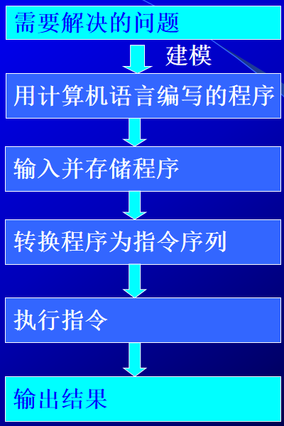

* 程序——运算的全部步骤

  指令——每个步骤

* 存储器的基本组成

  * 存储体-M
  * MAR：存储器地址寄存器，反映存储单元的个数，若MAR=4位，则存储单元个数=2^4=16
  * MDR：存储器数据寄存器，反映存储字长（即每个存储单元中存几个字），若MDR=8位，则存储字长=8

* 控制器的基本组成

  * PC：程序计数器，存放当前欲执行的指令的地址，可自动+1（即自动形成下一条指令的地址），(PC)+1->PC。
  * IR：指令寄存器，存放当前的指令
  * CU：控制单元，分析IR中指令的操作码是什么操作，并发出各种控制信号控制各器件。
  * 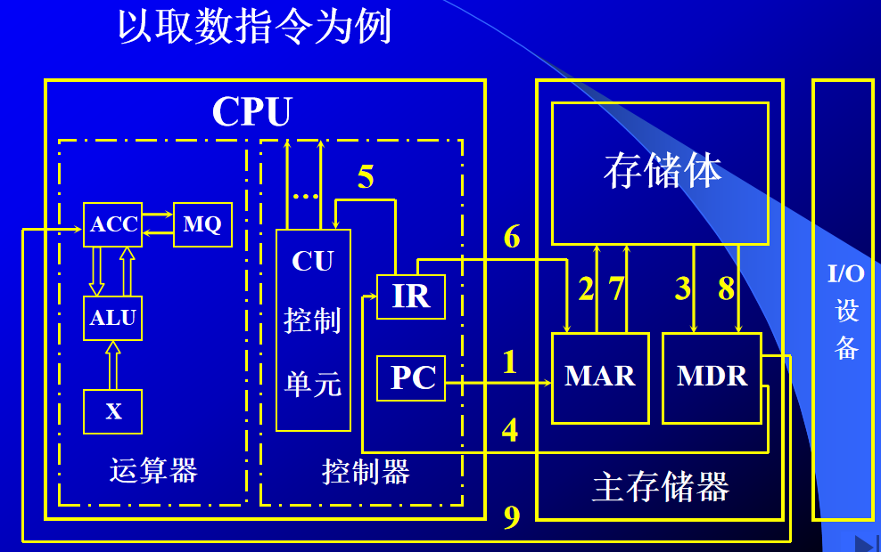

### 补充

#### 如何区分MDR中存放是数据还是指令

* 通过不同的时间段来区分。在取指令阶段取出的为指令，在执行指令阶段取出的为数据。
* 通过地址来源区分。由PC提供的存储单元地址取出的为指令，由指令的地址码部分提供的存储单元地址取出的为操作数。
* 一般将指令和数据分别存放在存储区的不同区域。

### 计算机硬件的主要技术指标

* 机器字长：CPU一次能处理数据的尾数，一般与CPU寄存器的位数有关。
* 存储容量：主存容量+辅存容量；主存容量=存储单元个数*存储字长。常用字节数来描述主存容量和辅存容量。
* 运算速度
  * MIPS：百万条指令每秒，是单位时间内执行指令的平均条数的单位
  * CPI：执行一条指令所需的时钟周期（机器主频的倒数）
  * FLOPS：浮点运算次数每秒

# 计算机系统的硬件结构

## 第4章 存储器

### 存储器的层次结构

* 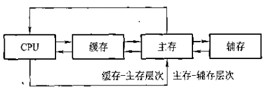

#### 缓存-主存层次

* 主要解决CPU与主存速度不匹配的问题。缓存的速度比主存速度高，将CPU近期要用的信息调入缓存，CPU就可直接从缓存中获取信息，从而提高访存速度。但缓存容量小，故需不断将主存内容调入缓存。

#### 主存-辅存层次

* 主要解决存储系统的容量问题。辅存速度比主存低，且不能与CPU直接交换信息，但容量比主存大得多，可以存放大量暂时未用到的信息。当CPU需要用这些信息时，再将辅存内容调入主存，供CPU访问。

### 主存储器

#### 主存中存储单元地址的分配

* 大端存储模式：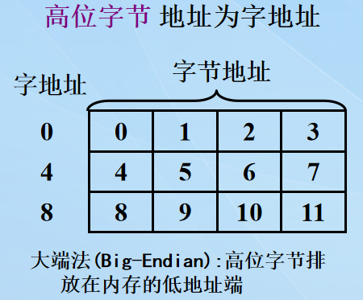
* 小端存储模式：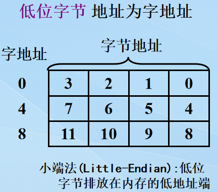
* 边界对齐存储模式：处理器为了提高处理性能对存取数据的起始地址提出的要求，存储字长取8的倍数。
* 按字寻址和按字节寻址（注意不同的分配方法，字节与字的换算关系不同

#### 动态RAM刷新

* 刷新指的是先将原存信息读出，再由刷新放大器形成原信息并重新写入的再生过程。（因为电容漏电）

* 在一定时间（一般2ms）内必须对DRAM的全部单元刷新一次。2ms就称为刷新周期。

* 刷新方法通常有3种：

  * 集中刷新
    * 在规定的一个刷新周期内，对全部存储单元集中一段时间**逐行**进行刷新，刷新时必须停止读/写操作
    * 存在连续的死区（即刷新时无法读写，称为死区）
    * 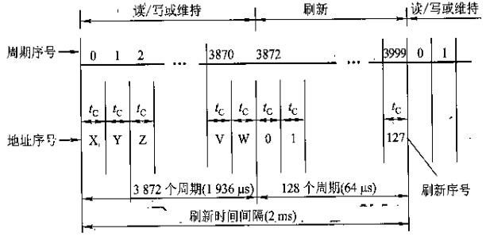
  * 分散刷新
    * 对每行存储单元的刷新分散到每个存取周期内完成
    * 把机器的存取周期tc分为两段，前半段用来读写或维持信息，后半段用来刷新。
    * 这样理论上不存在停止读写的死时间（实际上是不存在大片连续的死时间，死时间被划分在每个存取周期里了）
    * 缺点：存取周期变长，系统运行速度降低，存在无效刷新。
    * 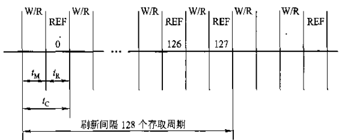
  * 异步刷新
    * 前两种方法的结合。
    * 在2ms（刷新周期）内将全部存储单元刷新一遍。每隔刷新周期/存储行数这样一段时间刷新一行，每行刷新的时间仍为一个存取周期的长度。刷新一行只停止一个存取周期。
    * 缩短了死时间，对前两种方式趋利避害，提高了整机工作效率。

  #### 存储器与CPU的连接

  ##### 存储器扩展

  * 存储容量一般以xK x y位的方式表示，y表示存储字长，x为存储器字的数量（地址个数）
  * CS表示片选信号，头上一个杠说明低电平有效。
  * 注意片选信号的选择、生成，可用译码器生成片选信号。

  ###### 位扩展

  * 扩展y，即扩展存储字长。将数据线进行扩展。

  ###### 字扩展

  * 扩展x，即扩展存储器字的数量（地址个数、存储单元数）。将地址线进行扩展。

  ###### 字、位扩展

  * 既增加存储字的数量，又增大存储字长。

  ##### 存储器与CPU的连接

  ###### 地址线的连接

  * 将存储芯片的地址线与CPU地址线的低位连接，高位用做其他用途，比如片选信号。

  ###### 数据线的连接

  * 需使用位扩展使存储芯片的数据位数与CPU的数据线数相等

  ###### 读写命令线的连接（WE/WR,带杠表示低电平有效）

  * 直接与存储芯片的读写控制端相连，高电平为读，低电平为写
  * ROM的读写直接接地，RAM才需接CPU读写控制线

  ###### 片选线的连接（CS，带杠表示低电平有效）

  * 片选信号与CPU访存控制信号MREQ（带杠表示低电平有效）有关。

  ###### 选择存储芯片

  * 一般用ROM存放系统程序，RAM用于用户程序。

  ###### 补充

  * 3-8译码器使能输入端的圆圈表示低电平有效（也即输入低电平才可正常工作），而输出端的圆圈也表明低电平有效（即，译码所得对应输出端口输出低电平，其余端口均输出高电平）
  * 逻辑门的输入输出的圆圈可直接看作非门。

### 高速缓存寄存器

#### 命中率与主存系统效率

* CPU欲读取主存某字时，有两种可能。一种是所需要的字已在缓存中，直接访问cache即可。另一种是所需的字不在cache中，需将该字所在的主存整个字块一次调入cache中（cache与主存间一次传送一个字块），主存块调入缓存块后，二者建立了对应关系。
* 用命中率来衡量cache的效率，命中率指CPU要访问的信息已在cache中的比率。
* **计算公式**
  * cache命中率=cache命中次数/（cache命中次数+访问主存次数）
  * 访问效率=cache访问时间/平均访问时间
    * 其中平均访问时间=cache命中率 x cache存取周期+(1-cache命中率) x 主存存取周期

#### cache与主存的映射

##### 直接映射（固定的映射关系）

* 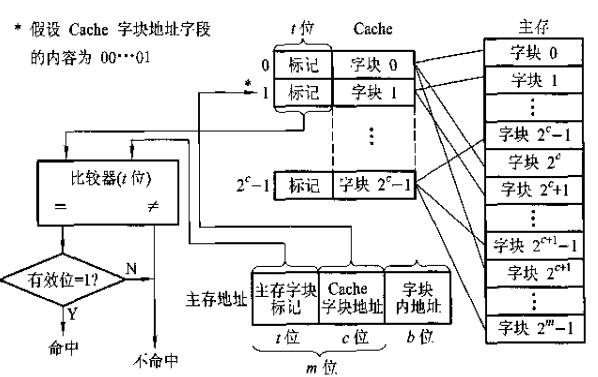
* 优点：实现简单，可简易判断所需字块是否在缓存中
* 缺点：不够灵活，每个主存块只能固定对应某个缓存块，这样即使缓存内空着许多其他的位置也无法占用，缓存的存储空间利用率不高。
* 主存地址的各部分的含义：
  * c位的cache字块地址可帮助找到该主存地址映射在cache中的哪个位置，c位正好对应cache的大小；
  * t位主存字块标记对应于cache地址中的前t位标记，若二者比对相同，则表示该主存位置存储的数据和cache对应位置存储的数据是对应的（建立了映射）；
  * b位的字块内地址表示一个块（一行）内有几个字（可想象为一个二维数组，一行就是一个块，一个项就是一个字）。

##### 全相联映射（灵活性大）

* 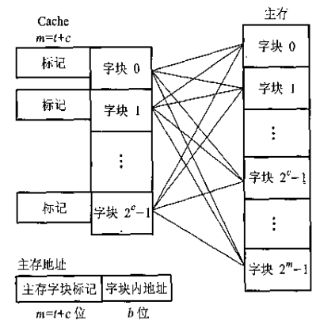
* 可将主存中每个字块映射到cache中的任何一块上。
* 主存地址各部分含义
  * m位的主存字块标记，对应于cache上的标记字段，二者比较后，标记字段若相同则表示二者对应，即要访存的贮存内容已在cache内
  * b位的字块内地址，同上。

##### 组相联映射（前两者折中）

* 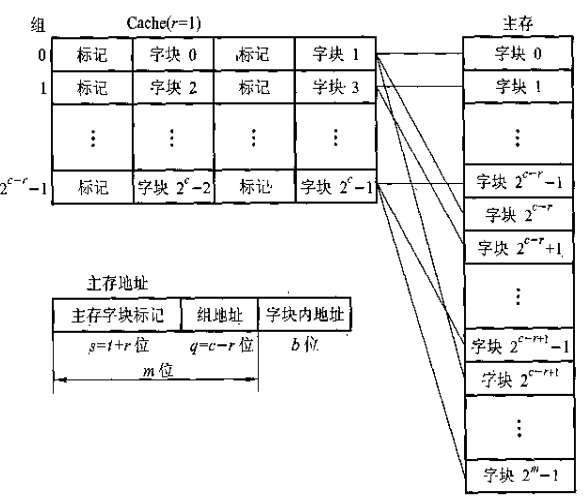
* 将cache分为q组，每组有r块。主存块按模q映射到缓存的第i组中（的任意位置），即映射到组是固定的，而组内是灵活的。
* 主存地址各部分含义
  * s位的主存字块标记，同上
  * q位的组地址，实际上表示的是分了2^q组，每组内有2^r块
  * b位字块内地址，同上

## 第5章 输入输出系统

### I/O设备编址方式

#### 统一编址

* 将I/O地址看作存储器地址的一部分。

#### 独立编址（不统一编址）

* I/O地址和存储器地址是分开的，所有对IO设备的访问必须有专门的IO指令

### I/O设备与主机信息传送的控制方式

#### 程序查询方式

* CPU通过程序不断查询IO设备是否已做好准备（查询IO设备的状态），若查得IO设备准备就绪，将数据从IO接口送到CPU，再由CPU送到主存，这样一个字一个字地传送，直至数据块中数据传送完毕，CPU回到原来的程序。若查得IO设备未准备就绪，就继续查询直至准备就绪。
* 一启动IO设备，CPU就不能执行原程序，持续不断查询IO设备得准备情况。
* CPU和IO设备串行工作，CPU工作效率不高。

#### 程序中断方式

* CPU启动IO设备后，不查询IO设备的准备情况，而是继续执行自身的程序，当IO设备准备就绪并向CPU发出中断请求后CPU才予以响应。
* 在IO设备准备时，CPU和IO设备是并行工作的。

#### DMA方式

* 主存和IO设备间有一条数据通路，二者交换信息无需将信息由CPU中转。无需调用中断服务程序。
* 周期窃取（挪用）：若出现DMA和CPU同时访问主存，CPU总将总线占有权让给DMA，时间一般为一个存取周期。

### I/O接口

#### 接口和端口的概念

* 端口指接口电路中一些寄存器，用来存放数据信息、控制信息和状态信息，分别被称为数据端口、控制端口和状态端口。
* 若干个端口加上相应的控制逻辑才能组成接口，接口是两个系统或者部件间的交接部分。

#### 接口的功能和组成

* 选址功能
* 传送命令的功能
* 传送数据的功能
* 反映IO设备工作状态的功能

### 程序查询方式

#### 程序查询流程

#### 程序查询方式的接口电路

### 程序中断方式

#### 中断接口电路

* 中断请求触发器INTR
* 中断屏蔽触发器MASK
* 完成触发器D
* CPU总在统一的时间，即每条指令执行阶段的最后时刻，查询所有设备是否有中断请求，若有请求则响应
* 排队器，按中断源的优先级进行排队
* 中断向量地址和中断服务程序入口地址

#### 中断过程

##### 中断请求

* 中断请求触发器INTR置为1，标志着设备向CPU提出中断请求

##### 中断判优

* 提出中断请求后，INTR被送到排队器，按优先级进行中断判优

##### 中断响应

* 若CPU允许中断（EINT=1)且设备被排队器选中，则进入中断响应阶段，中断响应信号INTA将排队其的输出送到编码器，形成向量地址。

##### 中断服务（中断处理）

* 向量地址中存放的是无条件转移指令，执行后转移到中断服务程序的入口地址开始执行中断服务程序，进入中断处理阶段。

##### 中断返回

* 中断服务程序的最后一条指令是中断返回指令，执行结束时中断返回到原程序断点处。

#### 中断服务程序的流程

* 四大部分：保护现场，中断服务，恢复现场，中断返回
* 保护现场
  * 保存程序断点，由中断隐指令完成。
  * 保存通用寄存器和状态寄存器的内容，由中断服务程序完成。
* 中断服务
  * 中断服务程序的主体部分，进行中断处理
* 恢复现场
  * 中断服务程序的结尾部分，退出服务程序前将现场恢复到原寄存器中
* 中断返回
  * 中断服务程序的最后一条指令是中断返回指令，返回到原程序断点处

##### 单重中断服务程序和多重中断服务程序的区别

* 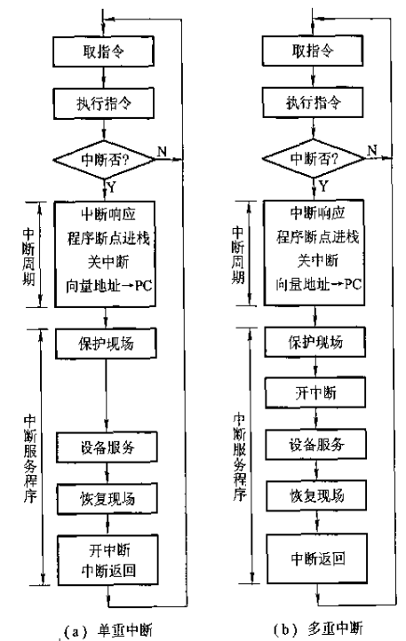
* 关中断使EINT=0，不再响应别的中断。
* 多重中断为实现多重，在中断服务程序的开始就开中断，可有优先级更高的中断请求将该中断给中断掉。

### DMA方式

* 主存和DMA接口间有条数据通路，故主存和IO设备交换信息时，不经由CPU也无需CPU暂停现行程序为IO设备服务（仅需交接总线权限即可），省去保护现场、恢复现场等操作，工作速度高。

#### 周期窃取（周期挪用）

* 当CPU和高速IO（通过DMA接口）同时访问主存时，CPU总将总线占有权让给DMA接口使用，使用时间为一个存取周期。
* IO设备每挪用一个主存存取周期都要申请总线控制权、建立总线控制权和交还总线控制权。

#### DMA接口的功能和组成

##### DMA接口的功能

* 向CPU申请DMA传送
* 在CPU允许DMA传送时，处理总线控制权的移交。
* 在DMA期间管理系统总线，控制数据传送
* 确定数据传输的起始地址和数据长度，在数据传输过程中修改数据地址和数据长度
* 数据块传送结束时发出DMA操作完成的信号给CPU

##### DMA接口的组成

* 主存地址寄存器AR
* 字计数器WC
* 数据缓冲寄存器BR
* DMA控制逻辑
* 中断机构
* 设备地址寄存器DAR：存放IO设备的设备码

#### DMA传送过程

* DMA传送过程分为预处理、数据传送、后处理三个阶段
* DMA方式是以数据块为单位传输数据的

# CPU

## 第6章 计算机的运算

### 无符号数

* 所有的位均为数值部分，用来表示大小。

### 有符号数的表示（整数和小数）

* 真值与机器数：带正负号的数被称为真值，而将正负号数字化（0表示正，1表示负）的数称为机器数，机器数指的就是机器中用来表示数的原码、补码、反码等。**以下针对二进制真值来说明机器数的表示**
  * 原码表示
    * 数值部分与数的真值相同，而将符号用数字表示，0正1负，无论整数还是小数（这里的小数指纯小数）均是如此，书写时在整数的符号位和数值位间用逗号隔开。
    * 原码表示中+0和-0是不同的，也就是说0要占两个码字。
  * 补码表示
    * 符号位用数字表示，0正1负，正数的数值部分与原码相同，负数的补码数值部分将原码数值部分按位取反，末位+1，得到补码。整数小数同理
    * 补码表示中0只有一种码字表示
  * 反码表示
    * 符号位用数字表示，正数的数值部分与原码相同，负数的补码数值部分将原码数值部分按位取反，得到反码。整数小数同理。
    * 反码中+0的表示不同于-0
  * 移码表示
    * 一般用移码表示浮点数的阶码，可一眼看出阶码的相对大小
    * 将补码的符号位取反，可得移码
    * 移码中0也是只用一种码字表示
  * 总结
    * 原码反码补码都是对于有符号数而言的，其首位为符号位，0正1负，反码和补码对于正数来说数值部分不变，负数才改变。
    * 已知一个数x的补码，求-x的补码，则将x的补码连同符号位在内求补，可得-x的补码。

### 数的表示

#### 定点表示

* 分整数定点机和小数定点机，小数点位置固定。数值部分位数为n时整数定点机表示范围为-（2^n-1）~（2^n-1），而小数定点机的表示范围是-（1-2^(-n))~（1-2^(-n))
  * 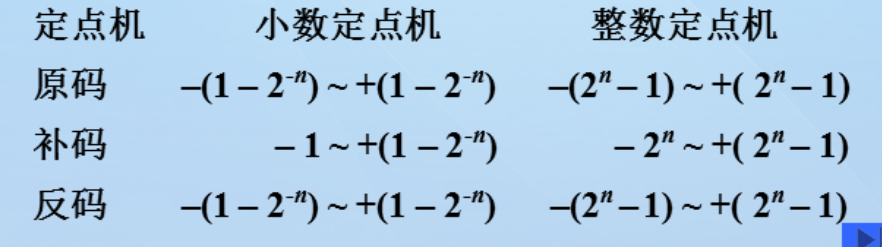
* 仅能存储纯小数和纯整数
* 若处理的数不是纯小数/纯整数，应乘上比例因子再处理。

#### 浮点表示

* 浮点数指小数点位置可以“浮动”的数，即小数点位置并非固定不变（实际上我们通过移动数来造成小数点的“移动”）
* **规格化形式（对于N=S*r^j）**
  * S为尾数（可正可负），r为基数（2，8，16等），j为阶码（可正可负），当浮点数的尾数由小数表示，且最高位为1时（即规格化数的绝对值在1/2和1之间），称为浮点数的规格化形式，规格化形式的精度最高。
  * **浮点数的规格化**：修改阶码，同时左/右移动尾数，使非规格化数规格化，分别称为左规和右规。
    * 基数=2时，尾数最高位=1的数为规格化数。
    * 左规：尾数左移一位，阶码-1
    * 右规：尾数右移一位，阶码+1
  * 特例：[-1/2]的补不是规格化数，[-1]的补是规格化数（边界情况单独拿出来考虑）
* 浮点机中浮点数的表示形式：阶码（阶符+阶码数值部分）+尾数（数符+尾数的数值部分）
* **浮点数的表示范围**（以阶码数值位取m位，尾数数值位取n位为例）
  * 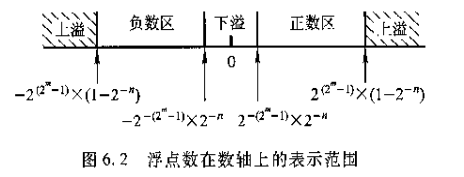
  * 当浮点数的阶码大于最大阶码2^m-1时，称为上溢，当浮点数阶码小于最小阶码-（2^m-1）时，称为下溢。
  * 上溢时机器停止运算，进行中断溢出处理；下溢时机器继续运行，将该数按机器零处理。以上处理无论尾数为何值
* 计算机中浮点数的阶码和尾数可采用同一种机器数来表示，也可采用不同机器数来表示。
* **机器零**
  * 当浮点数尾数=0时，无论其阶码为何值，或者阶码<=其最小数时，无论尾数为何值，机器均把该浮点数当作机器零看待，即000...0000
* IEEE754标准
  * 
  * 隐藏位：省略规格化尾数最高位的1

### 定点运算

#### 移位运算

* 移位运算与加法相结合，实现乘除运算
* **移位添补规则**
  * 算术移位（有符号数的移位）
    * 对正数，其原反补码左/右移，均空位补0
    * 对负数，原码左/右移补0，补码左移补0，右移补1，反码左/右移补1
  * 逻辑移位（无符号数的移位）
    * 逻辑左移，高位移丢，低位补0
    * 逻辑右移，低位移丢，高位补0

#### 加法与减法运算

* 采用补码进行加减运算，连同符号位一起运算，符号位产生的进位自然丢掉（相当于取模了）
  * 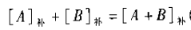
  * 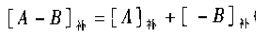

* 溢出判断
  * 单符号位判溢出。做加减法时，若实际参与操作的两个操作数（如减法中则为A的补和-B的补）符号相同，运算结果与原来两操作数的符号不同，则发生了溢出。
    * 硬件实现：将符号位的进位与最高有效位（符号位的右边第一位）产生的进位进行异或，若异或结果为1，则溢出，为0则未溢出。
  * 双符号位判溢出。两位符号位随数值部分一起参与运算，高位符号位产生的进位自动丢失，若判断溢出，则表明溢出，若判断未溢出，则可得正确结果。
    * 变形补码：两位符号位，真值为正的数其符号位为00，真值为负的数其符号位为11
    * 溢出判断标准：当结果得两位符号位不同时，表明发生了溢出，否则未溢出。结果得高位符号位始终代表结果真正得符号。

#### 乘法运算

##### 原码一位乘

* 乘积的符号由两乘数的原码的符号位异或得到
* 乘积的数值部分由两数的绝对值相乘，按既定的表求解：
  * 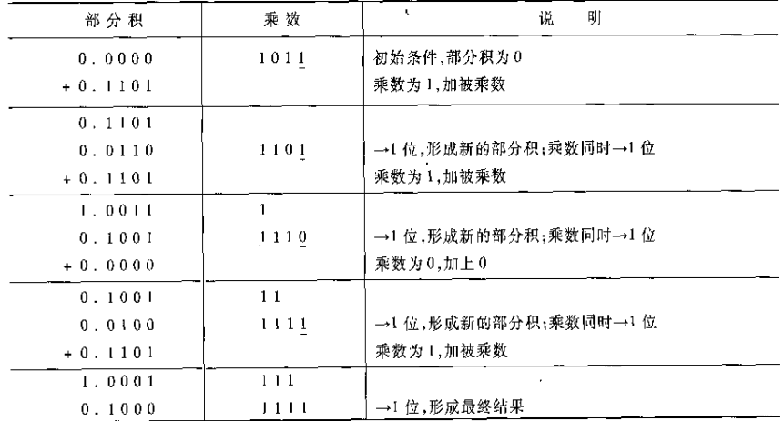
  * 通过移位和加法来实现，总共经过n次加法和n次移位（n为两数的位数），根据移位次数确定运算是否结束
  * 初始部分积=0，乘数的数值部分写在外面，被乘数作为每次的加数，根据乘数的末位值确定被乘数是否与当前部分积相加，若=1则相加，然后结果和乘数同时右移一位；若=0，则+0，同样使结果和乘数同时右移一位。
  * 最终剩余的部分积和乘数（的数值部分）连接起来，即是结果。
  * 移位操作均为逻辑移位（补0）

##### 补码一位乘

* Booth算法（被乘数x和乘数y的符号均为任意）/（也被称为）比较法
  * x和y的符号位也参与计算，在计算表中的乘数一栏中应将乘数的符号位与数值位一同填入。
  * 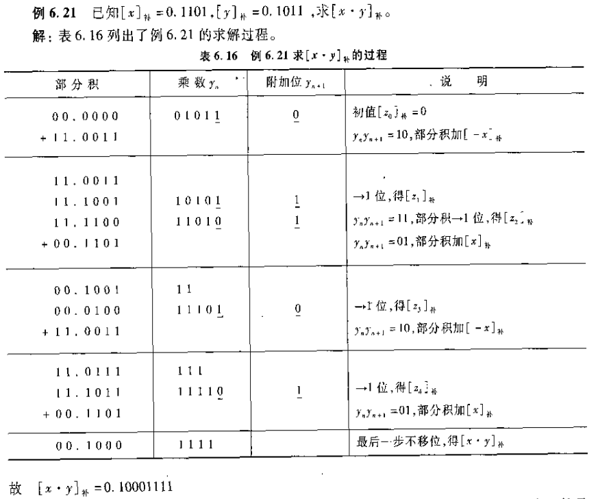
  * 计算表由部分积、乘数yn，附加位yn+1和说明组成，部分积初始值为0，附加位初始值为0，保存乘数右移移丢的低位，开始计算时和每次移位后应计算yn+1-yn的差值，若为-1则加上[-x]的补，右移；若为1则加上[x]的补，右移；若为0则直接右移（相当于加0右移），共移位n次（n为两乘数位数），最后一步计算和后不移位，部分积与乘数拼起来即为计算结果。
  * 移位均为算术移位
  * 部分积取双符号位填上
* 校验法
  * 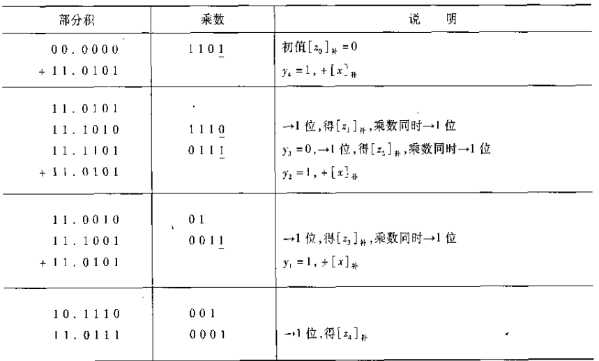
  * 按类似于原码一位乘的计算表进行计算，即看乘数最后一位是1还是0，为1则+[x]补,再右移一位，为0则直接右移一位。
  * 由于是补码运算，部分积采用双符号位。且移位为算术移位。
  * 乘数不写符号位。
  * 共移位n位（最后作和后移位最后一次）
  * 校验：
    * 若乘数y为正，则正常按类似于原码一位乘计算即可，最终答案即为部分积拼上乘数。
    * 若乘数y为负，则在正常运算得出结果后加上[-x]补，即为最终结果（校正后的）。

#### 浮点四则运算

##### 浮点加减运算（一般按双符号位补码计算）

* 步骤

  * 对阶（使两浮点数小数点位置对齐）

    * 对阶原则：小阶向大阶看齐，即小阶增大到与大阶一致，小阶对应的尾数右移。
    * 首先，求出阶差；然后，对阶。

  * 尾数求和

    * 将对阶后的两个尾数按定点加减的运算法则求和/差

    * 一般按补码计算，则按补码加减运算规则即可。

      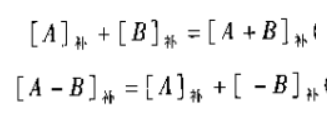

  * 规格化

    * 将求和/差后的尾数规格化
    * 是否规格化的判定：尾数的补码的最高数值位与符号位不同时，为规格化形式，否则不为。（考虑两种特殊情况，-1/2不是规格化数，-1是规格化数）
    * 具体左规还是右规，视情况而定。

  * 舍入

    * 考虑尾数右移时移丢的数值位，常用两种方法
    * “0舍1入”法
      * 若右移移丢的低位为0，则直接舍去即可。若移丢的低位为1，则在尾数末位+1，若+1后尾数再次溢出，应再做一次右规
    * “恒置1”法
      * 无论移丢的位是1还是0，均将尾数末位置为1

  * 溢出判断

    * 判断结果是否溢出
    * 当“尾数求和”步骤得出的结果的双符号位不相同（01/10）时，并不代表溢出，应将此数右规，再根据阶码判断溢出。
    * 判读溢出标准：在舍入处理后，看阶码的阶符，若为01，则为上溢，需作溢出处理，若为10，则为下溢，按机器零处理，不作溢出处理。（一般说的浮点溢出均指上溢）
    * 若溢出，给出溢出判断即可。

## 第7章 指令系统

### 指令的一般格式

#### 扩展操作码技术

* 操作码的位数随地址数的减少而增加
* 计算四、三、二、一、零地址指令的映射关系

### 寻址方式（10种）

* 一般格式
  * 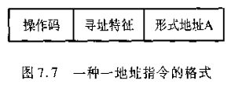
  * 寻址特征字段表明寻址的具体方式

#### 数据寻址

* 立即寻址
  * 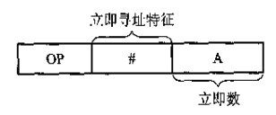
  * A所在的位置为操作数本身（而非操作数的地址），被称为立即数，以补码形式存放。
  * 优点：可立即取得操作数；
  * 缺点：A的位数限制了立即数的范围
* 直接寻址
  * 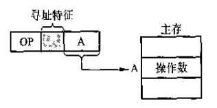
  * 形式地址A即是操作数A的真实地址EA，直接可以按地址A访存取到A
  * 优点：只需访存一次，不需额外计算操作数的地址
  * 缺点：A的位数限制了操作数的寻址范围，且修改操作数的地址必须修改A，不太方便。
* 隐含寻址
  * 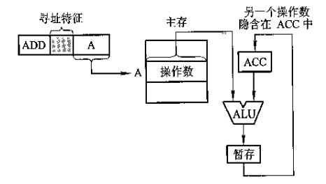
  * 指令中不明显给出一个操作数的地址，该操作数隐含在某个寄存器中
  * 优点：有利于缩短指令字长
* 间接寻址
  * EA=(A)，指令的形式地址A中不直接给出操作数A的地址，而是给出操作数有效地址所在的存储单元的地址（地址的地址），而需要多次访存（递归）。
  * 优点：与直接寻址相比，扩大了操作数的寻址范围；便于编制程序
  * 缺点：需访存两次或多次，指令访存时间长。
* 寄存器（直接）寻址
  * 在寄存器寻址指令的地址码字段中直接指出了操作数所在寄存器的编号
  * 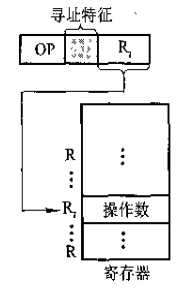
  * 优点：操作数不在主存中而在寄存器中，无需访存，减少了执行时间；且地址码字段仅需指出存储器编号，节省存储空间。
* 寄存器间接寻址
  * 按寄存器直接寻址在寄存器中寻到的不是操作数而是操作数在主存中的地址。
  * 优点：有效地址不存放在主存中而是存放在寄存器中，相比间接寻址少访存一次。
* 基址寻址
  * 需设有基址寄存器BR，操作数的有效地址等于指令中的形式地址与基址寄存器中的地址（基地址）相加，EA=A+(BR)
  * 分显式和隐式，显式需由用户指定用哪个寄存器（寄存器编号）作基址寄存器，隐式则计算机中固定且专门设有基址寄存器，只需在寻址特征字段反映出基址寻址即可。
  * 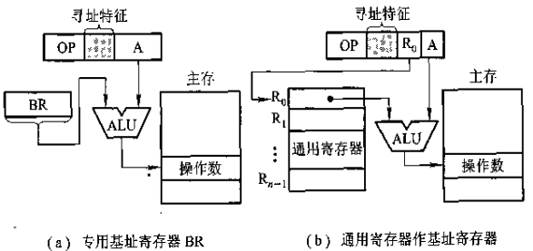
  * 优点：可扩大操作数的寻址范围
* 变址寻址
  * 与基址寻址极为相似。需设有变址寄存器IX，操作数的有效地址等于指令中的形式地址与变址寄存器中的内容相加之和，EA=A+(IX)
  * 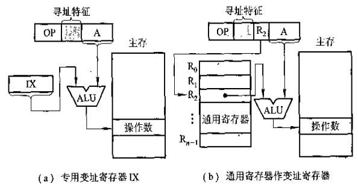
  * 优点：扩大操作数的寻址范围。
* 相对寻址
  * 相对寻址的有效地址是将PC中的内容（当前指令的地址）与指令字中的形式地址A相加而得，EA=(PC)+A
  * 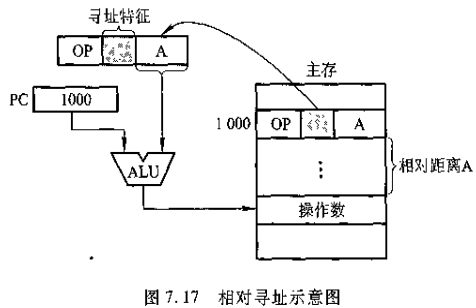
  * 常被用于转移类指令，转移后得目标地址与当前指令（PC中的内容）有一段距离，称为相对位移量。
  * 特点：转移地址不固定，随（PC）而变。
* 堆栈寻址
  * 需计算机中设有堆栈，用堆栈指针SP指出栈顶地址，操作数地址总被隐含在SP中。

#### 基址寻址和变址寻址的区别

* 基址寻址主要用于为程序或数据分配存储空间，故基址寄存器的内容通常由操作系统或管理程序来确定，在程序执行过程中其值不可变，而指令字中的A是可变的。
* 变址寻址中，变址寄存器的内容是由用户设定的，在程序执行过程中其值可变，而指令字中的A是不可变的。

### 指令格式举例

#### 指令格式设计举例

* 结合操作码扩展、寻址方式的先修知识，将书上例题搞懂。

## 第8章 CPU的结构和功能

### 指令周期流程

#### 指令周期

* CPU每取出并执行一条指令所需的全部时间称为指令周期，即CPU完成一条指令的时间
* 取指周期
  * 完成取指令和分析指令的操作
* 执行周期
  * 完成执行指令的操作
* 由于不同指令的操作功能与寻址方式不同，指令周期也不相同。

#### 指令周期的流程

* 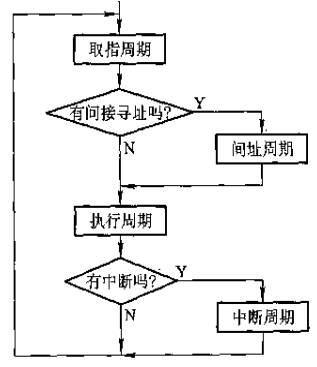
* 其实上图也需判断是否有执行周期，有的指令无执行周期。

### 中断系统

#### 中断隐指令

* 中断隐指令指机器指令系统中没有的指令,是CPU在中断周期由硬件自动完成的。一条中断隐指令分为以下三个操作：
  * 保护程序断点。将当前PC中的内容（程序断点）保存到存储器中。
    * 存入存储器特定单元（如0号地址）中
    * 存入堆栈
  * 寻找中断服务程序的入口地址
    * 中断周期结束后进入下条指令（中断服务程序的第一条指令）的取指周期，因此在中断周期中必须取得中断服务程序的入口地址。
    * 中断周期内，将向量地址送到PC，使CPU执行下一条无条件转移指令，转至中断服务程序的入口地址（对应硬件向量法）
    * 中断周期内，将软件查询入口地址的程序的首地址送到PC，使CPU执行中断识别程序，找到中断服务程序的入口地址（对应软件查询法）
  * 关中断
    * 使允许中断触发器EINT=0
    * 在CPU进入中断周期后，为确保CPU操作不受到新的中断请求的干扰，在中断周期内必须关中断。

  #### 中断屏蔽技术

  * 主要用于多重中断（中断嵌套，在执行一个中断源的中断服务程序时收到了新的中断请求，若CPU对新请求不响应，执行完当前中断服务程序后再响应，称为单重中断，若直接响应，则为多重中断）

  ##### 屏蔽触发器与屏蔽字

  * 屏蔽触发器可屏蔽中断源，MASK=1时屏蔽，对应每个中断请求触发器就有一个屏蔽触发器。
  * 所有屏蔽触发器组合在一起，构成了n位屏蔽寄存器，屏蔽寄存器的内容称为屏蔽字。
  * 屏蔽字与中断源的优先级一一对应。屏蔽字中为1的意为屏蔽掉该优先级比自己低的中断源。

  ##### 通过中断屏蔽技术改变中断源的（处理）优先级

  * 优先级分为响应优先级和处理优先级，响应优先级是硬件设定好的，无法改变，可以改变处理优先级，体现在CPU执行程序的轨迹上就是CPU首先执行到该中断源（响应），但因优先级更高的中断源提出中断，故又跳转到优先级更高的中断源进行（处理）。
  * 通过改变屏蔽字可以改变CPU处理中断的次序
  * 响应优先级和处理优先级顾名思义，在“响应”时看响应优先级，在响应后执行服务中断程序时为处理阶段，看“处理”优先级。
  * 响应优先级通过题干中的硬件排队优先次序给出，是固定的。处理优先级可通过设置（改变）屏蔽字和恢复屏蔽字来改变，是可变的。

  ##### CPU执行程序的轨迹

  * 根据各中断源响应优先级和处理优先级画出轨迹。

# CU

## 第9&10章 控制单元的功能与设计

### 微操作命令的分析

* 分取指周期、间址周期、执行周期、中断周期四部分分别分析。

### 指令周期、机器周期和时钟周期的概念和关系

* 机器周期
  * 所有指令执行过程中的一个基准时间。
* 时钟周期
  * 控制计算机操作的最小时间单位，在每个节拍内机器可完成一个或几个需同时执行的操作。
* 指令周期
* 关系
  * 指令周期由多个机器周期组成，机器周期由多个时钟周期组成。

### 组合逻辑设计

* 代表指令各周期的微操作命令及节拍安排
* 节拍安排规则
  * 有些微程序的次序不容改变
  * 凡是被控制对象不同的微操作，若能在一个节拍内执行，应尽可能安排在同一个节拍内
  * 如果有些微操作所占时间不长，应将他们安排在一个节拍内完成

### 微程序设计

#### 微程序控制器组成

* 控制存储器
* 控存地址寄存器CMAR
* 控存数据寄存器CMDR
* 顺序逻辑

#### 微指令格式

* 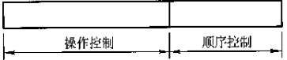

* 操作控制字段发出各种控制信息，顺序控制字段指出下条微指令的地址
